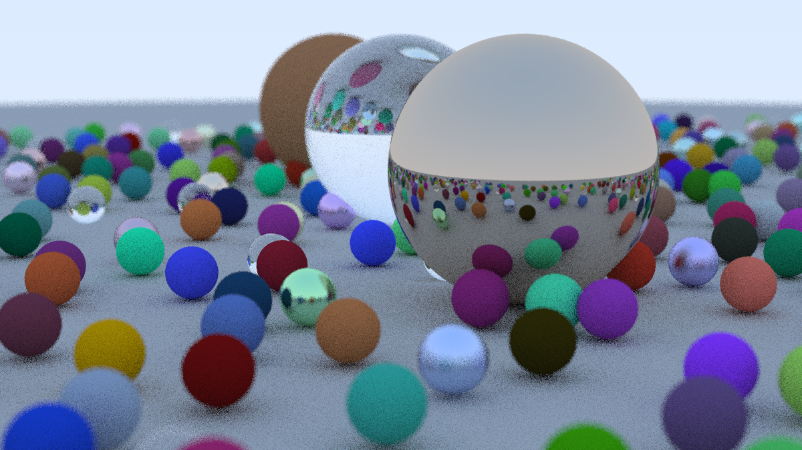

# Ray Tracing in One Weekend
This repo contains my Golang code-along with [_Ray Tracing in One Weekend_](https://raytracing.github.io/books/RayTracingInOneWeekend.html).

The Bash script [feh](https://feh.finalrewind.org/) image viewer to look at generated images.

The final render is shown below:

